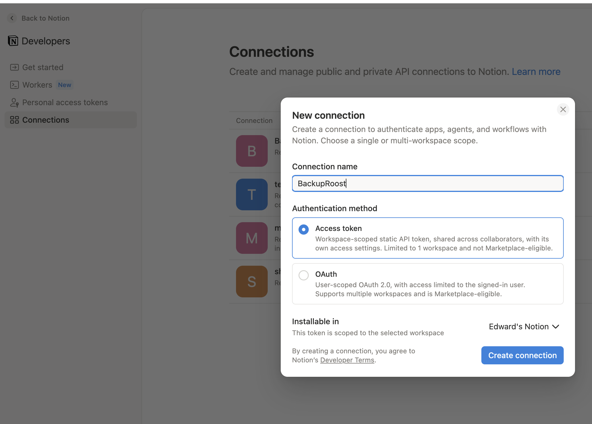
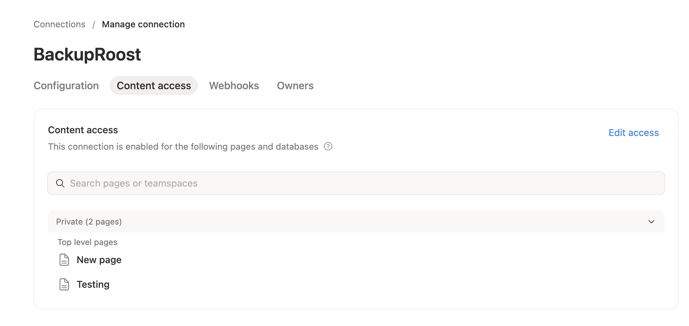
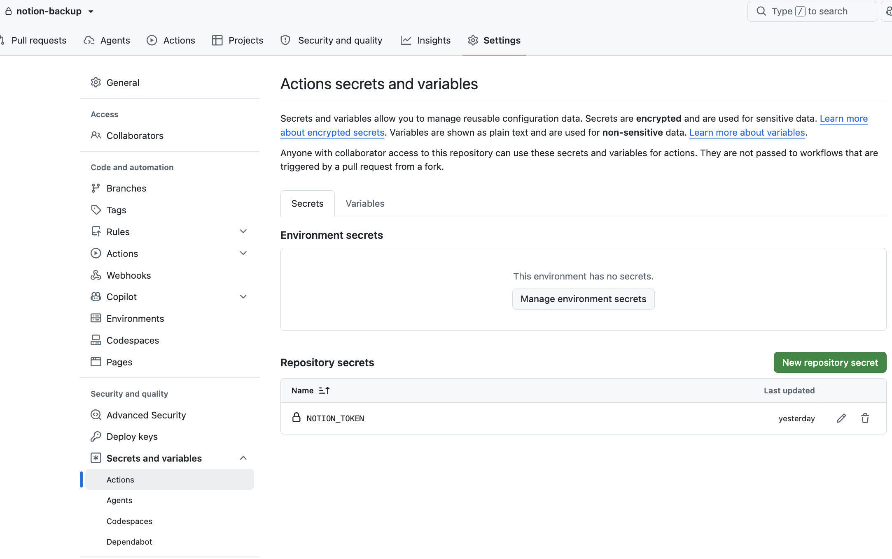
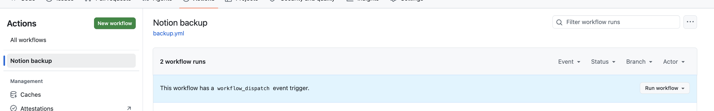

# 🪺 Your automatic Notion backup

This repository backs up your Notion workspace **every night, automatically, for free** — as readable files with full version history. Set it up once (about 10 minutes of clicking, no coding, no terminal) and never think about it again.

Why you want this: Notion has no automatic backup. Deleted pages are gone from the trash after 30 days, version history only reaches back 7–90 days depending on your plan, and the official export is manual and lossy. This repo is your insurance.

> **Reading this on the template page?** Click the green **Use this template** button (top right) → **Create a new repository** → name it something like `notion-backup` → select **🔒 Private** → **Create repository**. Then follow the steps below *in your new repository*.

## Step 1 — Create a Notion connection *(~3 minutes)*

1. Open [notion.so/profile/integrations](https://www.notion.so/profile/integrations) (sign in if asked).
2. Click **New connection**. Name it `BackupRoost`, keep **Access token** as the authentication method, pick your workspace, and click **Create connection**.
3. In the connection's settings, under **Capabilities**, only **Read content** is needed — and you can select **No user information**.
4. Copy the **Access token** (the copy icon next to the hidden `••••` field; the code starts with `ntn_` or `secret_`). Keep it handy for Step 3.

## Step 2 — Tell Notion which pages to back up

Still in the connection's settings:

1. Open **Content access**.
2. Click **Edit access**.
3. Select the **top-level pages** you want backed up. **All sub-pages are included automatically** — you only need the top of each tree.

*(You can also connect from inside Notion later — on any page: ••• → Connections → BackupRoost.)*

## Step 3 — Give this repository the secret

1. In **this repository** on GitHub: **Settings** → **Secrets and variables** → **Actions**.
2. Click **New repository secret**.
3. Name: `NOTION_TOKEN` (exactly like that). Value: paste the secret from Step 1.
4. Click **Add secret**.

## Step 4 — Turn it on

1. Open the **Actions** tab of this repository. If GitHub asks, click **"I understand my workflows, go ahead and enable them."**
2. Click **Notion backup** in the left sidebar → **Run workflow** → green **Run workflow** button.
3. Wait a minute, then refresh. A green checkmark means your first backup is done — go back to the repo's front page (the **Code** tab) and your pages are in the [`pages/`](pages/) folder. *(Large workspaces sync at ~3 pages/second on the first run; after that only changed pages are fetched, so nightly runs are fast.)*

That's it. Every night at 03:00 UTC a new backup commit appears — no further action ever needed.

## What's in your backup

| Path | What it is |
|---|---|
| `pages/<name>/<Title>.md` | Each page as Markdown — click it to read right here on GitHub |
| `pages/<name>/page.json` | The raw Notion data for that page (enables future automated restore) |
| `data-sources/` | Your database definitions |
| `manifest-latest.json` | Report of the last run — synced/skipped/failed counts and warnings |

Every version of every page is kept forever: open any file → **History** to see it as it was on any past day.

## Getting a page back

Lost a page in Notion? Open its `.md` file here and **download it** (the ⤓ icon in the file view). Then in Notion's left sidebar: **Import** → **Text & Markdown** → pick the file — Notion rebuilds the page. For an older version of the page, open the file's **History** first and download from there.

Honest caveats: don't copy-paste the raw text instead of importing (it comes in as plain text, not formatted blocks); a few Notion-specific elements like toggles may need a quick touch-up after import; and images aren't recoverable yet — their links expire an hour after backup (downloading images into the backup is on the roadmap).

**Work in progress: one-click restore — straight back into Notion, exactly as it was.** Want it? [👍 this issue](https://github.com/smol-bytes/backuproost-template/issues/1) so we know to build it faster.

## Troubleshooting

- **Run failed, log mentions `401`** — the `NOTION_TOKEN` secret is missing or wrong. Redo Step 3.
- **"Found 0 pages"** — the integration isn't connected to any page. Redo Step 2.
- **A warning about page count dropping** — you unshared pages, or something was mass-deleted in Notion. Your backed-up files are kept either way; check `manifest-latest.json`.
- **Backups stopped after ~2 months** — GitHub pauses schedules in repos with no activity. Open the **Actions** tab and click re-enable.

## Honest limitations

- Only pages **connected to the integration** (Step 2) are backed up — Notion offers no "everything, forever" access.
- Comments, page permissions, and Notion's own version history can't be exported by any tool using the official API.
- Images and file attachments currently appear as links that expire after ~1 hour (downloading them into the backup is on the roadmap).

---

Powered by [BackupRoost](https://smol-bytes.github.io/backuproost-site/) — free, MIT-licensed. To change the schedule, edit the `cron` line in [`.github/workflows/backup.yml`](.github/workflows/backup.yml).
